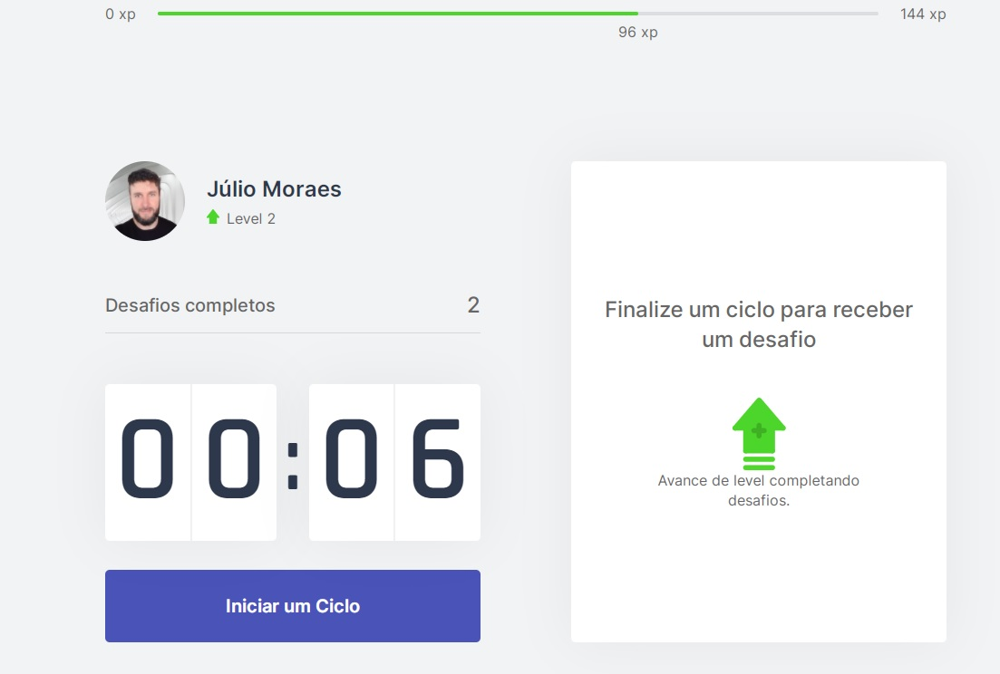
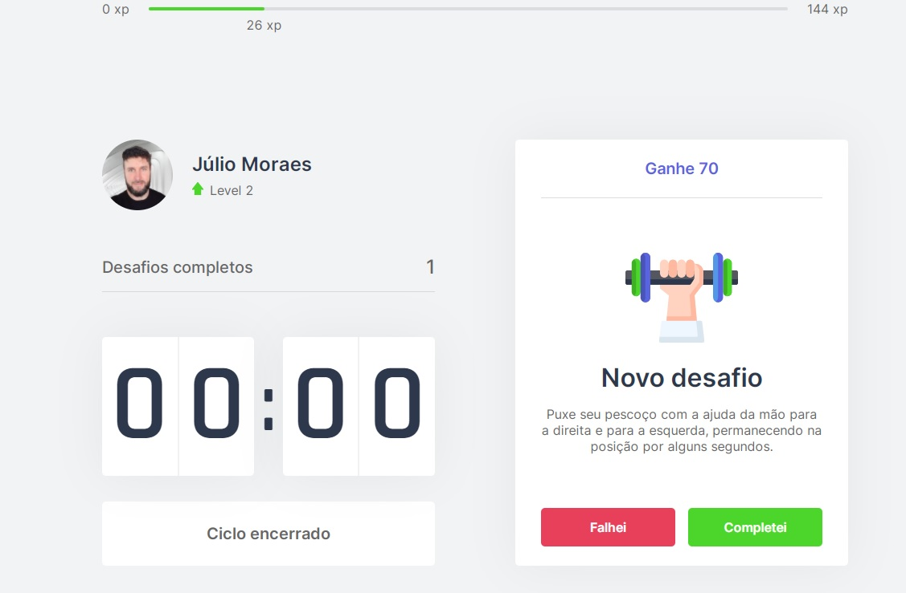

<h1 align="center">Move.it - NLW-4</h1>

  

  <a href="#-tecnologias">Tecnologias</a>&nbsp;&nbsp;&nbsp;|&nbsp;&nbsp;&nbsp;
  <a href="#-projeto">Projeto</a>&nbsp;&nbsp;&nbsp;|&nbsp;&nbsp;&nbsp;
  <a href="#-como-executar">Como executar</a>&nbsp;&nbsp;&nbsp;|&nbsp;&nbsp;&nbsp;
  <a href="#-licença">Licença</a>

  

 

## ✨ Tecnologias

Esse projeto foi desenvolvido com as seguintes tecnologias:

- [Next.js](https://nextjs.org/)
- [React.js](https://reactjs.org/)
- [TypeScript](https://www.typescriptlang.org/)

## 💻 Projeto

O Move.it é uma aplicação web que utiliza a técnica Pomodoro, que consiste na utilização de um cronômetro para dividir o trabalho em períodos de 25 minutos, separados por breves intervalos.

Esse projeto foi desenvolvido durante a trilha de React, na quarta edição da NLW. Aprendemos conceitos sobre o NextJs, React e armazenamento de dados em cookies.

    

    

    

    

## 🔥 Preview

## 🚀 Como executar

- Clone o repositório
- Instale as dependências com `yarn`
- Inicie o servidor com `yarn dev`

A aplicação pode ser acessada em [`localhost:3333`](http://localhost:3333).

## 📄 Licença

Esse projeto está sob a licença MIT. 

---

Feito com ♥ by [Julio Moraes](https://www.linkedin.com/in/j%C3%BAlio-c%C3%A9sar-ambos-moraes-2685381ba/)
